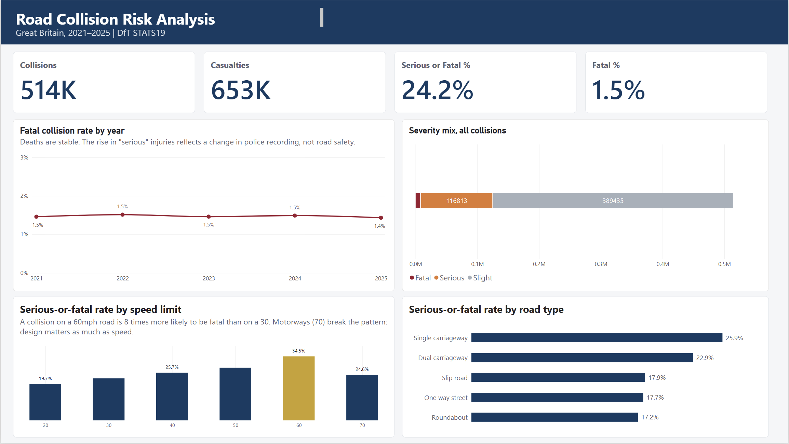
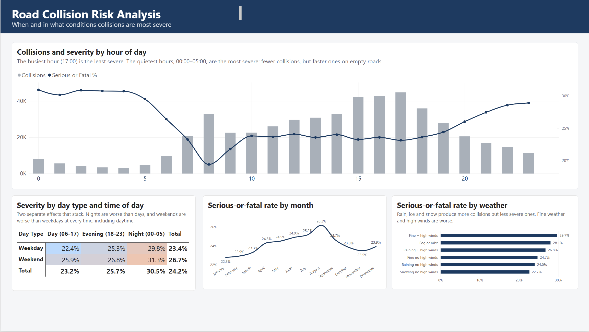

# UK Road Collision Risk Analysis

**An end-to-end analytics project: SQL Server data warehouse → SQL analysis → Power BI dashboard**

Analysis of **513,801 police-reported road collisions** in Great Britain (2021–2025), framed as work for a motor insurer's pricing team: *where, when and in what conditions do collisions become severe?*



---

## The finding that changed the analysis

The serious-or-fatal collision rate rose every year, from **22.5% in 2021 to 26.2% in 2025**. A 17% relative increase, with collision volumes flat. The obvious headline: *UK roads are becoming more dangerous.*

That headline is wrong.

Fatal collisions stayed flat across the same period (1,474 → 1,453; about 1.4–1.5% of collisions throughout). A death is hard to misclassify, so the two measures disagreeing meant something was off.

The cause was a **change in how severity is recorded**. Police forces have been moving from officer-judgement severity to injury-based recording, which classifies more injuries as serious. The injury-based share went from 50% of collisions in 2021 to **87% in 2025**, while each method's own rate stayed roughly flat:

| Year | Injury-based share | Injury-based rate | Officer-judgement rate | Overall |
|---|---|---|---|---|
| 2021 | 50% | 26.5% | 18.6% | 22.5% |
| 2025 | 87% | 27.0% | 21.4% | 26.2% |

The weighted arithmetic reproduces the headline exactly. The entire "trend" came from the mix shifting between two measurement methods.

**What I did about it:** no severity trend over time is reported anywhere in this project; the fatal rate is used where a trend is needed; and every other comparison pools all five years so the method mix affects them equally.

---

## Key findings

All figures are **serious-or-fatal rates**: of the collisions that occurred in a given situation, the percentage that were serious or fatal. The overall baseline is **24.2%**.

> Rates, not counts. Counts mostly track traffic volume — they show where collisions happen, not where they are dangerous.

**1. Speed limit is the strongest single factor.**
A collision on a 60mph road is **8× more likely to be fatal** than on a 30mph road (3.84% vs 0.87%). But 70mph motorways break the pattern, with a *lower* serious rate (24.6%) than 60mph roads (34.5%). Motorways separate traffic and remove junctions and pedestrians; 60mph roads are undivided rural A- and B-roads. **Road design matters as much as the posted limit.**

**2. The most dangerous hours are the quietest ones.**
The collision peak at 17:00 has the *lowest* severity rate of the day (23.1%). The 00:00–05:00 hours have the fewest collisions and the highest severity (~30.5%). Rush hour produces congested, low-speed impacts; the small hours produce fast ones on empty roads.

**3. Weekend and night effects are separate, and they stack.**

| | Day (06–17) | Evening (18–23) | Night (00–05) |
|---|---|---|---|
| **Weekday** | 22.4% | 25.3% | 29.8% |
| **Weekend** | 25.9% | 26.8% | **31.3%** |

Weekends are worse at *every* time of day, including daytime, so this is not just Saturday nights: it points to leisure and rural driving.

**4. Bad weather is not the danger people assume.**
Rain (24.0%) is *below* the baseline, and frost or ice (22.7%) is lower still. The highest weather rates are fine weather with high winds (29.7%) and fog (28.1%). Adverse conditions increase the *number* of collisions but not their severity — drivers slow down.

**5. Darkness matters, but the road matters more.**
Unlit darkness looks alarming at 35.0% against 23.2% in daylight. Holding the speed limit constant separates the effects: within 30mph roads, unlit darkness adds about 8 points — a real effect. But **daylight on a 60mph road (34.2%) is worse than unlit darkness on a 30mph road (29.1%)**. Most of the raw darkness effect is really the rural-road effect.

**6. Driver age is U-shaped, with the older end worse.**
Drivers over 75 are involved in the most severe collisions (30.9%), ahead of 16–20 year-olds (26.8%), with 26–35 lowest (22.0%). This measures **outcome severity, not fault or frequency**: older people are physically more fragile, and young drivers still have far more collisions per mile driven.

**7. Pedestrians and motorcyclists carry the severe outcomes.**
Pedestrians are 14% of casualties but **25% of deaths**. Collisions involving a 500cc+ motorcycle are serious or fatal **52.8%** of the time, against 21.1% for cars — and those riders have a fatality rate five times that of car occupants.



---

## Architecture

Built as a **Medallion architecture** in SQL Server:

```
DfT CSV files  →  BRONZE  →  SILVER  →  GOLD  →  Power BI
                  (raw)     (clean)   (star schema)
```

| Layer | What it holds | Why |
|---|---|---|
| **Bronze** | Raw CSV data, all columns as text, loaded unchanged | A faithful copy that never fails to load and never silently alters a value, so any figure can be traced back to source |
| **Silver** | Cleaned, typed and decoded: codes become labels, `-1` becomes NULL or "Not recorded", UK dates parsed explicitly, primary keys enforced | One place for all cleaning logic, rebuilt from bronze by a single stored procedure |
| **Gold** | A star schema exposed as views: `dim_date` plus three fact views | The shape Power BI is built for; holds no duplicate data and always reflects current silver |

**Scale:** 513,801 collisions · 937,265 vehicles · 652,821 casualties · 2.1M rows total. A full silver rebuild takes about 70 seconds.

### Data quality approach

Every load is verified rather than assumed:

- **Reconciliation** — file line counts (PowerShell) compared against table row counts. All three matched exactly.
- **Row-count checks after every transformation**, to catch join fan-out.
- **Referential integrity** — zero orphan vehicles or casualties.
- **Independent validation of the date conversion** — DfT records the weekday separately, so the weekday derived from the converted date was compared against theirs: **0 mismatches across 513,801 rows**, ruling out the dd/mm vs mm/dd trap.
- **Range and plausibility checks** — speed limits 20–70; coordinates within Great Britain.

Test scripts live in [`/tests`](tests) and can be re-run after any rebuild.

---

## Repository

```
├── datasets/reference/   DfT data guide (code lookups)
├── docs/                 decisions log, business questions, findings, dashboard spec
├── scripts/
│   ├── 00_init/          database and schema creation
│   ├── 01_bronze/        bronze DDL and BULK INSERT loads
│   ├── 02_silver/        silver DDL, profiling, load stored procedure
│   ├── 03_gold/          date dimension and fact views
│   └── 04_eda/           analysis queries
├── tests/                data quality checks
└── powerbi/              .pbix report and screenshots
```

**Worth reading:** [`docs/decisions.md`](docs/decisions.md) records every design decision, the reasoning behind it, and the alternatives rejected. [`docs/findings.md`](docs/findings.md) holds the full analysis.

---

## Reproducing this

**Requirements:** SQL Server 2017+ with SSMS, Power BI Desktop.

1. Download the "last 5 years" collision, vehicle and casualty CSVs plus the data guide from the [DfT Road Safety Data page on GOV.UK](https://www.data.gov.uk/dataset/cb7ae6f0-4be6-4935-9277-47e5ce24a11f/road-safety-data). Raw data is not in this repo: the files are up to 104 MB and publicly available.
2. Place the CSVs in `C:\sql_data\stats19\` (a simple path the SQL Server service account can read).
3. Export the `2024_code_list` sheet of the data guide as `dft_code_list.csv` to the same folder.
4. Run in order: `scripts/00_init/init_database.sql` → `scripts/01_bronze/ddl_bronze.sql` → `scripts/01_bronze/load_bronze.sql` → `scripts/02_silver/ddl_silver.sql` → `scripts/02_silver/proc_load_silver.sql` → then `EXEC silver.load_silver;` → `scripts/03_gold/ddl_gold.sql`.
5. Run the scripts in `tests/` to verify.
6. Open the `.pbix` and point it at your `RoadSafetyDW` database.

---

## Limitations

1. **Police-reported injury collisions only.** Damage-only crashes and unreported injuries are absent, so this undercounts real road injuries.
2. **No traffic volume data.** These are severity rates *given a collision occurred*, not risk per mile driven. A high rate does not by itself identify a road to avoid.
3. **Severity is police-assessed**, not medically confirmed, and the recording method changed during the period (see above).
4. **Correlation, not causation.** Night, unlit roads, rural 60mph limits and driver mix all move together. Where possible, effects were separated by holding one factor constant.
5. **2025 figures may be provisional** and subject to revision.
6. Some fields carry meaningful missing data: vehicle age (39%) and engine size (25%) were excluded as analysis dimensions for that reason.

---

## What I would do next

- **Join traffic volume data** (DfT road traffic statistics) to convert severity rates into risk per vehicle-mile, which is what an insurer would actually price on.
- **Add population and deprivation data** by LSOA to examine exposure and equity.
- **Model rather than describe** — logistic regression on severity to estimate each factor's contribution while holding the others constant.
- **Automate the pipeline** with SQL Server Agent, and log run results to a table rather than printing them.

---

## Source and licence

Data: Department for Transport, Road Safety Data (STATS19), published under the Open Government Licence v3.0.

**Ahmad Sarosh** · Glasgow, UK
